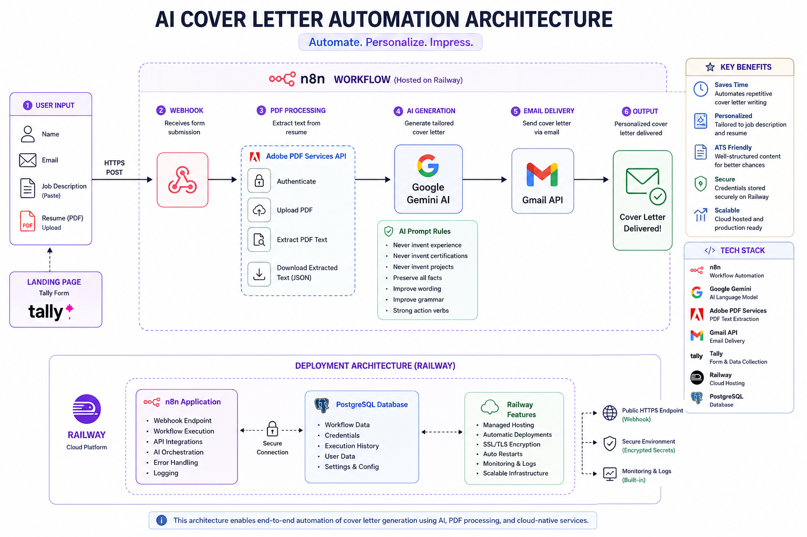

<p align="center">

# 🤖 AI Cover Letter Automation

Generate AI-powered, ATS-friendly cover letters from resumes and job descriptions using **n8n**, **Google Gemini**, **Adobe PDF Services**, and **Railway Cloud**.



</p>

> Generate personalized, ATS-friendly cover letters automatically using AI, workflow automation, and cloud deployment.


---

## 📖 Overview

Applying for jobs can be repetitive and time-consuming, especially when writing a new cover letter for every application.

This project automates the entire process.

Users simply:

✅ Enter their name

✅ Enter their email

✅ Paste a Job Description

✅ Upload their Resume (PDF)

The automation extracts resume content, compares it against the job description using **Google Gemini AI**, and generates a professional, personalized cover letter. The completed cover letter is then delivered directly to the user's email—all within seconds.

Live website @ Gamma AI --> https://precision-cover-letter-49qbjih.gamma.site/

---

# 🚀 Live Workflow

```
Tally Form
     │
     ▼
n8n Webhook
     │
     ▼
Adobe PDF Services
     │
Extract Resume Text
     │
     ▼
Google Gemini AI
     │
Generate Cover Letter
     │
     ▼
Gmail API
     │
     ▼
Delivered to User
```

---

# ☁️ Cloud Deployment

This solution is fully deployed on **Railway**.

```
                Railway Cloud
        ┌─────────────────────────┐
        │      n8n Workflow       │
        │                         │
        │ • Webhook               │
        │ • AI Automation         │
        │ • API Integrations      │
        └──────────┬──────────────┘
                   │
        ┌──────────▼──────────────┐
        │     PostgreSQL          │
        │                         │
        │ Workflow Database       │
        │ Credentials             │
        │ Execution History       │
        └─────────────────────────┘
```

---

# ✨ Features

- 📄 Resume PDF upload
- 📝 Job Description input
- 🤖 AI-generated personalized cover letters
- 📚 Resume text extraction using Adobe PDF Services API
- 📧 Automatic email delivery
- ⚡ Fully automated n8n workflow
- ☁️ Cloud-hosted on Railway
- 💾 Persistent PostgreSQL storage

---

# 🛠️ Technology Stack

| Category | Technology |
|----------|------------|
| Workflow Automation | n8n |
| AI | Google Gemini |
| PDF Processing | Adobe PDF Services API |
| Form | Tally |
| Email | Gmail API |
| Hosting | Railway |
| Database | PostgreSQL |

---

# 🔄 End-to-End Process

### 1️⃣ User Submission

The user fills out a Tally form with:

- Name
- Email
- Target Job Description
- Resume (PDF)

---

### 2️⃣ Workflow Trigger

The Tally form sends the submission to an n8n Webhook hosted on Railway.

---

### 3️⃣ Resume Processing

The workflow automatically:

- Authenticates with Adobe PDF Services
- Uploads the PDF
- Extracts resume text
- Downloads structured JSON content

---

### 4️⃣ AI Generation

Google Gemini receives:

- Resume content
- Job description

The AI then creates a tailored cover letter while following strict prompt engineering rules:

- Never invent experience
- Never invent projects
- Never invent certifications
- Preserve factual information
- Improve grammar
- Improve readability
- Optimize for ATS

---

### 5️⃣ Email Delivery

The finished cover letter is sent directly to the user's inbox using Gmail.

---

# 📂 Repository Structure

```
ai-cover-letter-automation/

├── README.md
├── workflow.json
│
├── assets/
│   ├── architecture.png
│   ├── railway.png
│   ├── workflow.png
│   └── landing-page.png
│
└── screenshots/
    ├── workflow.png
    ├── email.png
    ├── form.png
    └── output.png
```

---

# 📸 Screenshots

## Landing Page

> *(Add screenshot)*

---

## n8n Workflow

> *(Add screenshot)*

---

## Railway Deployment

> *(Add screenshot)*

---

## Generated Cover Letter

> *(Add screenshot)*

---

# 🎯 Skills Demonstrated

- Workflow Automation
- Cloud Deployment
- API Integration
- AI Prompt Engineering
- Event-Driven Architecture
- REST APIs
- PDF Processing
- Email Automation
- Webhook Development
- Production Deployment
- PostgreSQL
- Low-Code Automation

---

# 💡 Future Improvements

- Multiple writing styles
- DOCX resume support
- PDF export
- ATS scoring
- Resume improvement suggestions
- Multi-language support

---

# 📜 License

MIT License
